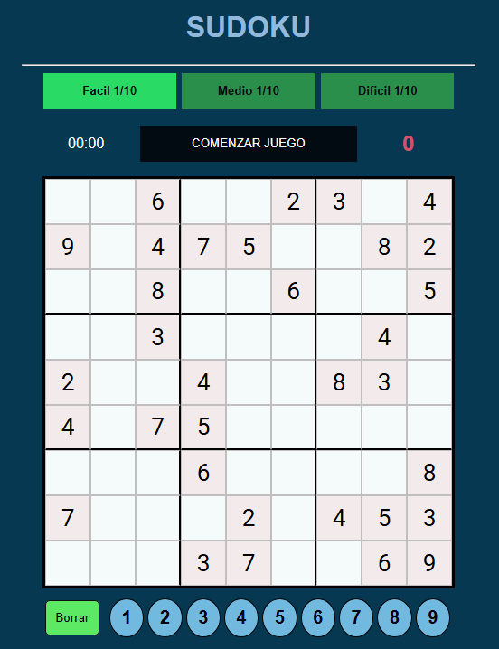

# 🧩 Sudoku

Juego clásico de Sudoku implementado con tecnologías web. Jugá directamente desde tu navegador.

🔗 **[Probar el juego online](https://lautaromuller.github.io/Sudoku/)**

## 🚀 Tecnologías utilizadas

- HTML
- CSS
- JavaScript
- JSON (para los tableros)

## 📂 Estructura del proyecto
- index.html: Interfaz principal del juego.
- style.css: Estilos visuales.
- script.js: Lógica del juego.
- tableros.json: Tableros predefinidos.

## ✨ Funcionalidades
- Carga dinámica de tableros.
- Interfaz simple e intuitiva.
- Validación básica del tablero.
